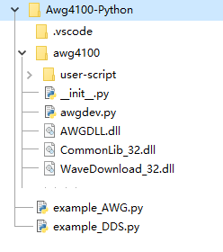

# AWG4100 Python API

Awg4100-Python.7z 包含了 `awg4100`模块与示例。
AWG4100用户手册.docx 是用户手册，包含接口说明。

## 使用说明

脚本运行环境为Python3(建议版本 > 3.6) 。为了方便各个版本使用，我们不提供需要安装的版本，使用时需要与 模块 `awg4100` 在同一目录下，如下所示，目录`awg4100`中的内容缺一不可。**使用前请确保Demo能够正确运行**

## 常见问题
### OSError: [WinError 126]
可能是由于缺失 VC运行时造成的，请安装msvc2013运行时环境。https://www.microsoft.com/zh-cn/download/details.aspx?id=40784  和  msvc2015 运行时环境 https://www.microsoft.com/en-us/download/details.aspx?id=48145 建议x86版本与x64版本都要安装。

如果安装之后依旧报错。请将 msvcp120d.dll 和 msvcr120d.dll 放到 `awg4100` 目录下。